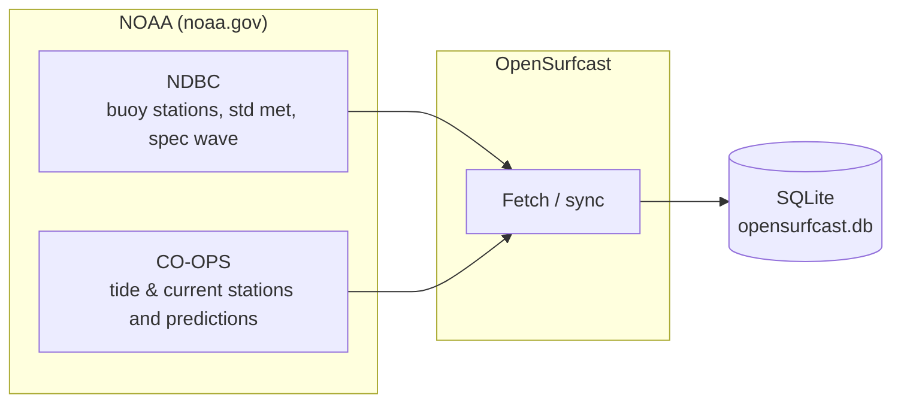

# OpenSurfcast

OpenSurfcast is an open-source Android app for marine conditions: **buoys**, **tides**, and **currents**. It shows real-time and predicted data from NOAA only—no app backend, no accounts, no tracking.

## What it does

- **Buoys** — Add NDBC buoy stations and view wave height/period, standard meteorological data, and spectral wave data. Browse the catalog, pick stations, and see detail screens with optional full-screen charts.
- **Tides** — Add NOAA CO-OPS tide stations and view predicted high/low water levels with configurable time windows and charts.
- **Currents** — Add NOAA CO-OPS current stations and view predicted flood/ebb velocities over time with charts.
- **Settings** — Theme (light/dark/system), metric vs imperial units, optional home station for sorting by distance, chart label preferences, and station sort order (alphabetical, latitudinal, or distance).
- **Logs** — In-app log viewer for debugging (no data sent off-device).

Data is fetched directly from NOAA (NDBC and CO-OPS). The app’s network access is restricted to `noaa.gov` only.

## Values

- **Open source** — Source code is available for inspection, modification, and redistribution.
- **No personal data** — The app does not collect, store, or transmit any personal data. No accounts, analytics, or third-party SDKs. Only NOAA public data is requested.
- **Appropriate for all ages** — No ads, no social features, no inappropriate content. Safe for family and educational use.
- **No app backend** — There is no OpenSurfcast server. All data comes from public NOAA sources (NDBC and CO-OPS).

## Built with

OpenSurfcast was developed in **Cursor IDE**, with most of the code written with **Anthropic** models (Sonnet and Opus) at the time of writing.

## Tech

- **Language:** Java 17  
- **UI:** Android XML layouts, Material Design 3  
- **Data:** NOAA NDBC (buoys), NOAA CO-OPS (tides and currents)  
- **Charts:** MPAndroidChart  

## Data flow

The app pulls data from NOAA and stores it locally in SQLite. The UI reads from the local database only.

## Requirements

- Android 7.0 (API 24) or higher  
- Network access (to fetch NOAA data)

## License

See the [LICENSE](LICENSE) file in this repository.
